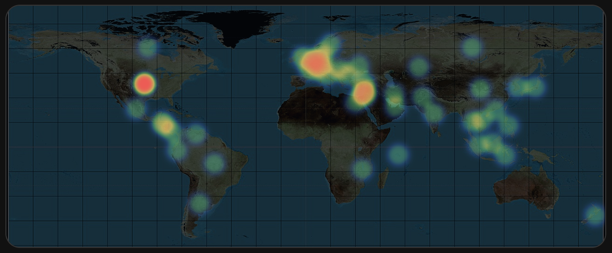
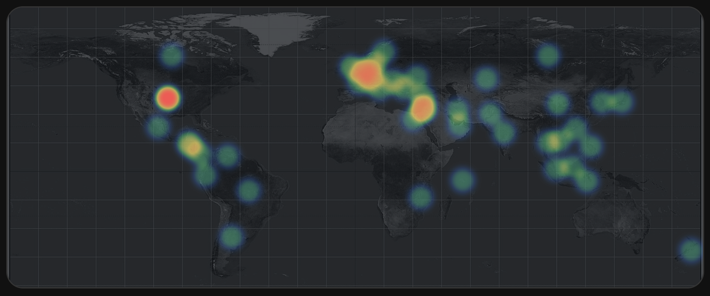
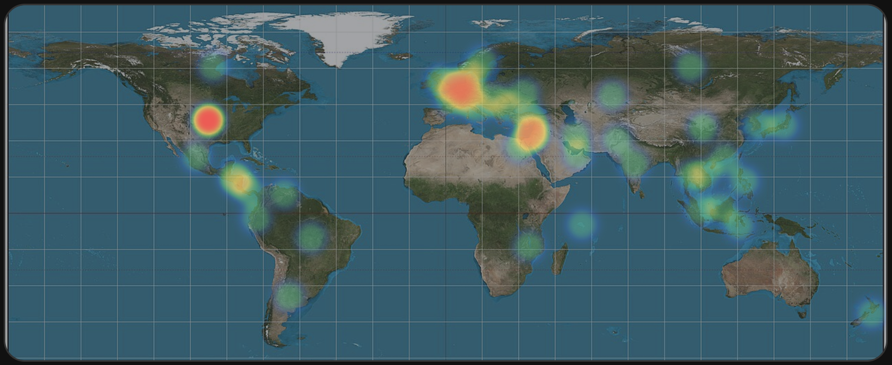

# World Heatmap Card

[](https://github.com/hacs/integration)
[](https://github.com/bullitt186/ha-world-heatmap-card/releases)
[](LICENSE)

A data-source-agnostic [Home Assistant](https://www.home-assistant.io/) Lovelace
card that renders geographic activity as a canvas heatmap over a static world
map.

The card reads a single entity whose attributes contain a `points` array of
`{ lat, lon, value }` objects — see [Data Shape](#data-shape) below. It does
not call any backend service or fetch its own data; any integration that
exposes points this way works.

| `dark` (default) | `muted` | `light` |
|:---:|:---:|:---:|
|  |  |  |

See [Map styles](#map-styles) for the full list, including `contrast` and `grid`.

## Install

### HACS

This card isn't in the default HACS store yet. Add it as a custom repository:

1. HACS → Frontend → ⋮ → Custom repositories.
2. Add `https://github.com/bullitt186/ha-world-heatmap-card`, category
   "Dashboard".
3. Install **World Heatmap Card**, then add the resource as described below.

### Manual install

1. Download `world-heatmap-card.js` from the
   [latest release](https://github.com/bullitt186/ha-world-heatmap-card/releases/latest)
   (or build it yourself, see [Development](#development)).
2. Copy it into `config/www/ha-world-heatmap-card/world-heatmap-card.js`.
3. Add the resource reference as described below.

### Add the resource

If you manage resources via YAML:

```yaml
resources:
  - url: /local/ha-world-heatmap-card/world-heatmap-card.js
    type: module
```

Or via the UI: **Settings → Dashboards → ⋮ → Resources → Add Resource**, URL
`/local/ha-world-heatmap-card/world-heatmap-card.js`, resource type
"JavaScript Module".

(For HACS installs, use `/hacsfiles/ha-world-heatmap-card/world-heatmap-card.js`
instead.)

## Using the card

```yaml
type: custom:world-heatmap-card
entity: sensor.omada_threat_heatmap_daily
```

All other options have sane defaults and can be tuned through the card's
visual editor — open it from the dashboard's card picker, no YAML required.

### Options

| Name | Type | Default | Description |
|------|:----:|:-------:|-------------|
| type ***(required)*** | string | | `custom:world-heatmap-card`. |
| entity ***(required)*** | string | | Entity whose attributes contain the heatmap points. |
| title | string | | Card title, shown when `show_title` is `true`. |
| points_attribute | string | `points` | Name of the entity attribute holding the points array. |
| map_style | string | `dark` | Background map filter, see [Map styles](#map-styles). |
| crop | string | `threats_xy` | How tightly the map crops to the data, see [Crop modes](#crop-modes). |
| scale | string | `log` | Intensity scaling applied to point values: `log`, `sqrt`, or `linear`. |
| color_theme | string | `default` | Heat gradient palette, see [Color themes](#color-themes). |
| radius | number | `24` | Heat point radius in pixels. |
| blur | number | `14` | Heat point blur in pixels. |
| opacity | number | `0.16` | Minimum opacity (`0.0`–`0.4`) for the dimmest visible point. |
| floor | number | `0.32` | Minimum normalized intensity (`0.0`–`0.6`) so low-volume points stay visible. |
| show_title | boolean | `false` | Display the card title. |
| show_bounds | boolean | `false` | Display the computed crop bounds, useful for debugging. |
| map_image_url | string | bundled equirectangular map | Override the background map image. |

#### Map styles

| Name | Description |
|------|-------------|
| `dark` | Inverted, desaturated, darkened — the default. |
| `muted` | Grayscale, dimmed. |
| `contrast` | High-contrast grayscale with a grid overlay. |
| `light` | Close to the source map's natural colors. |
| `grid` | Hides the map image entirely, leaving only a coordinate grid. |

#### Crop modes

| Name | Description |
|------|-------------|
| `threats_xy` | Crop tightly around the data on both axes (default). |
| `threats_lat` | Crop tightly on latitude only; show the full longitude range. |
| `world` | No crop — the full globe. |
| `no_antarctica` | Full globe, Antarctica trimmed off. |
| `temperate` | Temperate-latitude band only. |

#### Color themes

| Name | Description |
|------|-------------|
| `default` | Blue → green → yellow → red. |
| `reds` | Pale to deep red. |
| `yellows` | Pale to deep amber. |
| `greens` | Pale to deep green. |
| `blues` | Pale to deep blue. |
| `oranges` | Pale to deep orange. |
| `purples` | Pale to deep purple. |

## Data Shape

```json
{
  "points": [
    {
      "lat": 35,
      "lon": 105,
      "value": 23
    }
  ]
}
```

Only `lat`, `lon`, and `value` are read per point; any other fields (on the
points or alongside the array) are ignored.

## Credits

The default background map, `src/assets/world-map.jpg`, is
[Equirectangular_projection_SW.jpg](https://commons.wikimedia.org/wiki/File:Equirectangular_projection_SW.jpg)
by [Strebe](https://commons.wikimedia.org/wiki/user:Strebe), licensed under
[CC BY-SA 3.0](https://creativecommons.org/licenses/by-sa/3.0/). It's bundled
unmodified; override it per-card with `map_image_url` if you need a different
license.

## Development

```bash
npm install
npm run dev
```

Build the Home Assistant module:

```bash
npm run build
```

The build output is:

```text
dist/world-heatmap-card.js
```

When developed next to `ha-omada-open-api`, the existing devcontainer can mount
this `dist/` directory into Home Assistant. Use this dashboard resource:

```yaml
url: /local/ha-world-heatmap-card/world-heatmap-card.js
type: module
```
